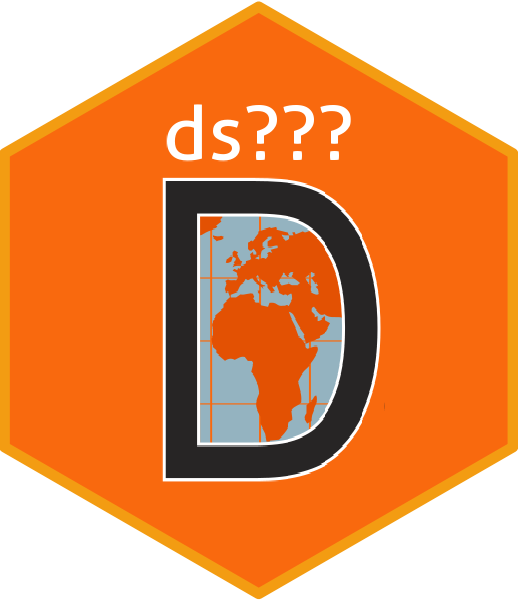

<!-- README.md is generated from README.Rmd. Please edit this file -->

```{r setup, include = FALSE}
knitr::opts_chunk$set(
  collapse = TRUE,
  comment = "#>",
  fig.path = "man/figures/README-",
  out.width = "100%"
)
```

# dstemplate 

## Overview

dstemplate provides a custom [pkgdown](https://pkgdown.r-lib.org) template for DataSHIELD community packages. This template is based on the [`tidytemplate`](https://tidytemplate.tidyverse.org/) created by [RStudio](https://www.rstudio.com/).

### `_pkgdown.yml` for your package

```yaml
template:
  package: dstemplate
  bootstrap: 5
```

### Adding links to new authors

If you want an author of your package to recieve a custom link on your `pkgdown` site there are two options:

#### 1) Modifiy your `_pkgdown.yml` file

Add to your YAML file the author fields

```
authors:
  Escribà-Montagut Xavier:
    href: https://github.com/ESCRI11
```

Please note that this information has to be consistent with the `DESCRIPTION` file of your package

```
Authors@R: c(
    person("Escribà-Montagut", "Xavier", , "xavier.escriba@isglobal.org", role = c("aut", "cre"))
  )
```

#### 2) Create a PR to [`datashield/dstemplate`](https://github.com/datashield/dstemplate)

Update the [template file](https://github.com/datashield/dstemplate/blob/main/inst/pkgdown/BS5/_pkgdown.yml) with your information on the `authors` field.

## Usage info
If you’re building your site using GitHub actions or other similar tool (or in local), you’ll need to have installed `datashield/dstemplate`. Please do so using `remotes::install_github('datashield/dstemplate')`.

## Linking GitHub to the `pkgdown` site

To link the GitHub repository and the `pkgdown` site, make sure to include the [URL on the `_pkgdown.yml`](https://github.com/datashield/dstemplate/blob/main/_pkgdown.yml#L5)

```
url: https://github.com/datashield/dstemplate
```

And on the [DESCRIPTION file](https://github.com/datashield/dstemplate/blob/main/DESCRIPTION#L9)

```
URL: https://github.com/datashield/dstemplate
```

:warning: **If you are using GitHub pages to host the `pkgdown`**: Make sure to include an empty `.nojekyll` file at the root of the site. (e.g. https://github.com/datashield/dstemplate/blob/main/docs/.nojekyll)
